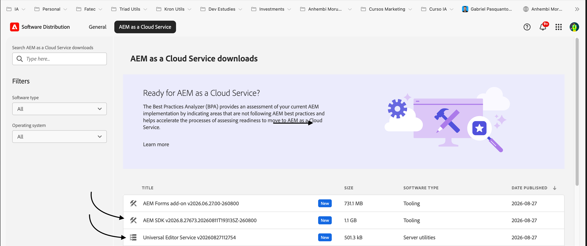

🇧🇷 [Ler em português](docs/pt-BR/README.md)

# aem-local-development

A local runtime for **AEM as a Cloud Service (AEMaaCS)**, ready for
development, with the minimum possible manual configuration. Clone this
repo, drop the official Adobe AEM SDK into `sdk/`, and run `./aem start`.

This project provides **infrastructure only**: Author, Publish, Dispatcher,
the Universal Editor Service, HTTPS, and the AEM-side OSGi config the
Universal Editor needs. It does **not** manage your AEM project — no
`pom.xml`, no components, no frontend, no archetype, no code. Your project
lives in its own repo and talks to the ports this project exposes.

Everything here follows Adobe's *current* Experience League documentation,
not older tutorials — see [References](#references) for the exact pages.

**Scope:** built and tested against **AEM as a Cloud Service**. It does not
target AEM 6.5 / on-premise (different installer, requires
`license.properties`, different Dispatcher artifact).

## Two ways to run it

| | Dev Container | Native |
|---|---|---|
| Author / Publish | ✅ | ✅ |
| Universal Editor + HTTPS | ✅ | ✅ |
| Dispatcher | ✅ | ❌ (Adobe's Dispatcher Tools require Docker) |
| Need Java/Node/Maven installed yourself | No — the container provides them | Yes |

Both modes run the exact same `./aem` script and commands. Pick whichever
fits your machine — see [Quick start](#quick-start) for both.

## Prerequisites

**Dev Container mode:**
- Docker Desktop, OrbStack, or another Docker-compatible runtime, running
  and with `docker` on your `PATH`.
- VS Code with the Dev Containers extension.

**Native mode:**
- Java 21 (the AEM SDK requires it as of Adobe's 2026.2.0 maintenance
  release — newer/older JDKs on your `PATH` will be rejected).
- Node.js 20+ (required by the Universal Editor Service) and `npx`.
- `openssl` (for local certificates), `unzip`, bash.
- Docker only if you also want the Dispatcher — see below.

macOS/Linux only for now (bash-based). Windows developers should use the
Dev Container, which is the primary, cross-platform mode; native mode on
Windows would need Git Bash/WSL and hasn't been set up in this first pass.

## Getting the AEM SDK and Universal Editor Service

Both come from **Adobe Software Distribution**, under the
**AEM as a Cloud Service** tab — they're two separate downloads, in
different categories on the same page:



- **AEM SDK** (category *Tooling*, ~1.1 GB) → unzip it, or just drop the
  whole zip, into `./sdk/`.
- **Universal Editor Service** (category *Server utilities*, ~500 KB) →
  drop the zip (or the `.cjs` file) into `./ues/`. Only needed if you're
  using the Universal Editor.

Neither is included in this repository — both are Adobe-proprietary and
must never be committed.

## Quick start

### Option A — Native (no Docker)

```bash
git clone <this-repo>
cd aem-local-development
# get the AEM SDK (see above) and drop it into ./sdk/
./aem configure
./aem start          # Author + Publish
./aem status
```

### Option B — Dev Container

Open the repo in VS Code and choose **"Reopen in Container"**. The dev
container provides Java 21, Maven, Node 20, and Docker-in-Docker (for the
Dispatcher) — you don't install any of that yourself. Once inside, the
exact same commands apply: `./aem configure`, `./aem start`, etc. AEM's
`crx-quickstart` state is kept in named Docker volumes (not the bind-mounted
workspace) for performance; your repo files stay a normal folder, visible in
Finder/Explorer, on the host.

### Either way, once it's running

- Author: http://localhost:4502 (`/crx/de`, `/crx/packmgr`, `/system/console` all work as usual — this is the unmodified Adobe SDK)
- Publish: http://localhost:4503
- Default local credentials are AEM's own `admin`/`admin` — this project
  does not set or override that; change it via AEM itself once it's up.
- Publishing (Author -> Publish) works out of the box: the SDK's default
  replication agent ships disabled with placeholder values, so `./aem`
  enables it and points it at your configured Publish port automatically,
  in the background, shortly after Author finishes booting. Nothing to
  configure — just activate content from Author as usual and it reaches
  Publish.

For the Universal Editor, also start the UES and HTTPS:

```bash
./aem start ues ssl
```

For the full stack (Author, Publish, UES, HTTPS, Dispatcher — Dispatcher
needs Docker either way, see the table above):

```bash
./aem start full
```

## Layout

Everything below is generated by `./aem configure`/`./aem start` and
gitignored — safe to delete anytime, it's rebuilt on the next run. What
you actually commit to this repo is just the script, the config
templates, and the two placeholder folders you drop the SDK/UES into.

```
sdk/            you place the Adobe SDK zip (or just the quickstart jar) here
  .extracted/   quickstart.jar unzipped once (a cache — see below)
ues/            you place the Universal Editor Service zip/.cjs here
  .extracted/   the .cjs extracted once
certs/          self-signed cert/key, shared by local-ssl-proxy and UES
instances/
  author/       author's own jar copy + its crx-quickstart (state)
  publish/      same, for publish
  ues/          the running UES process's working directory
  run/          *.pid + *.out per service — how status/stop/logs work
                (see "Process tracking" below)
dispatcher/
  src/          Adobe's baseline Dispatcher config, copied in on first use
.vscode/
  launch.json   generated Java debug "Attach" configs (see below)
.env            your copy of config/.env.example
```

**Why each instance has its own full copy of the jar, not a shared one:**
`sdk/.extracted/quickstart.jar` is unzipped once from your SDK zip, then
*copied* (not linked) into each of `instances/author/` and
`instances/publish/` — about 480MB each, ~1GB total for both. Adobe's own
setup procedure has you copy the quickstart jar into a separate folder per
tier; sharing one file breaks this, because the Quickstart launcher
resolves the jar's canonical path to decide its own install location — a
symlink or hard link makes both tiers resolve to the same location and
collide there.

**Process tracking (`instances/run/`):** each service runs as a plain
background process (`nohup ... &`), not under a supervisor, so `.pid`
files are how `status`/`stop`/`restart` know what's actually running.
The `.out` files capture each process's raw stdout/stderr from the moment
it launches — for Dispatcher/UES/the SSL proxies, that's the only log
that exists; for Author/Publish, it's a secondary capture of very early
JVM output (before AEM's own logging starts) alongside the real log at
`crx-quickstart/logs/error.log`.

## Commands

| Command | What it does | Arguments |
|---|---|---|
| `./aem configure` | One-time (idempotent) setup: creates `.env`, detects/extracts the SDK jar, generates certs and the VS Code debug config | none |
| `./aem start` | Starts services | `[service...\|full]` — default `author publish` |
| `./aem stop` | Stops services | `[service...]` — default: everything currently running |
| `./aem restart` | Stops then starts | `[service...]` — default: whatever is currently running |
| `./aem status` | Shows what's running and on which ports/URLs | none |
| `./aem logs` | Tails a service's log — the real AEM log for author/publish (`crx-quickstart/logs/error.log`), raw process output for the rest | `<service> [-f]` |
| `./aem reset` | Wipes an instance's `crx-quickstart` (content/repository state) only | `<author\|publish\|all>` |
| `./aem shell` | A shell in the instance's own directory, or `exec` into the running dispatcher container | `<author\|publish\|dispatcher>` |

### Services (used with `start`/`stop`/`restart`)

| Service | Starts | Default port | Needs Docker |
|---|---|---|---|
| `author` | AEM Author | 4502 | No |
| `publish` | AEM Publish | 4503 | No |
| `ues` | Universal Editor Service (HTTPS) | 8000 | No |
| `ssl` | `local-ssl-proxy` in front of Author/Publish | 8443 / 8444 | No |
| `dispatcher` | Apache + the Dispatcher module | 8080 | **Yes** |
| `full` | Shorthand for all of the above | — | Yes (because of `dispatcher`) |

## Configuration (`.env`)

Copy `config/.env.example` to `.env` (or just run `./aem configure`, which
does it for you) and change only what you need. Every port is read once
and flows everywhere it's needed — the AEM instance, its OSGi config, the
SSL proxy, the Dispatcher's publish target, the VS Code debug config, and
the URLs `./aem status` prints. Change `AEM_PUBLISH_PORT` and the
Dispatcher automatically forwards to the new port; nothing is hardcoded
twice.

| Variable | Default | Controls |
|---|---|---|
| `AEM_AUTHOR_PORT` | `4502` | Author's HTTP port (and its debug port, `3<port>`) |
| `AEM_PUBLISH_PORT` | `4503` | Publish's HTTP port (and its debug port, `3<port>`) |
| `DISPATCHER_PORT` | `8080` | Dispatcher's port |
| `UES_PORT` | `8000` | Universal Editor Service's HTTPS port |
| `SSL_AUTHOR_PORT` | `8443` | HTTPS proxy in front of Author |
| `SSL_PUBLISH_PORT` | `8444` | HTTPS proxy in front of Publish |
| `CORS_ALLOWED_ORIGINS` | `https://localhost:3000` | Allowed origins, applied to both tiers |
| `CORS_ALLOWED_ORIGINS_AUTHOR` / `_PUBLISH` | (falls back to the one above) | Per-tier override, if they need to differ |
| `AEM_JAVA_HOME` | (uses `java` on `PATH`) | Point at a JDK 21 install if your default `java` isn't 21 |

A change to `.env` only takes effect the next time the affected service
starts — editing it while Author is already running does nothing on its
own; run `./aem restart author` (or the affected service) to apply it.

## Dispatcher

Dispatcher requires Docker — confirmed by Adobe's own Dispatcher Tools
documentation, which states Docker is required both for syntax validation
and for actually running it. There's no supported native path, so this
project doesn't attempt a workaround.

On Apple Silicon: current Dispatcher Tools releases ship a native arm64
image alongside the amd64 one, and `docker_run.sh` loads the right one on
its own — no Rosetta/`DOCKER_DEFAULT_PLATFORM` override needed (forcing
amd64 emulation on a modern release actively breaks it, since the amd64
image is never loaded into the local image cache).

See [dispatcher/README.md](dispatcher/README.md) for how the baseline
config is generated, and how to point at your own project's real
Dispatcher config (`dispatcher/src/`) instead.

## HTTPS

The Universal Editor requires HTTPS end-to-end: it serves itself over TLS
and refuses to load an HTTP page inside its frame, so Author needs TLS too.

- The Universal Editor Service has built-in HTTPS support and needs no
  proxy — `./aem start ues` points it at a locally generated certificate.
- Author (and Publish) get HTTPS via `local-ssl-proxy`, which Adobe
  documents for exactly this purpose in its Universal Editor tutorials:
  `./aem start ssl` runs it for you.
- A self-signed certificate is generated once into `certs/` (gitignored).

**One manual step:** your browser will warn about the self-signed
certificate the first time. Either accept the warning (e.g. visit
`https://localhost:8000/ping` and proceed past it once), or trust it in
your OS keychain if you want to skip that:

```bash
# macOS
sudo security add-trusted-cert -d -r trustRoot \
  -k /Library/Keychains/System.keychain certs/certificate.pem
```

## Reset

```bash
./aem reset author     # wipes instances/author/crx-quickstart only
./aem reset publish
./aem reset all
```

Reset never touches `sdk/`, `ues/`, `config/`, or `.env`. The next
`./aem start` rebuilds the instance from the SDK jar and reapplies the OSGi
configuration automatically.

## Java debugging in VS Code

`./aem configure` and `./aem start` both (re)generate `.vscode/launch.json`
with two ready-to-use "Attach" configurations, pointed at the debug ports
Author/Publish already open (`3<port>` — 34502/34503 by default, wherever
your configured `AEM_AUTHOR_PORT`/`AEM_PUBLISH_PORT` actually put them).
Open the Run and Debug panel, pick "Attach: Author" or "Attach: Publish",
and you're breakpointing inside a live AEM request — no manual setup, and
it can't point at a stale port after a port change. It's gitignored, same
as `.env` and `certs/` — generated, not hand-maintained.

This only resolves real source code if your AEM project is open in the
*same* VS Code workspace as this repo (e.g. a multi-root workspace with
both folders added). If you keep your project in its own separate VS Code
window instead, add the same two blocks from `.vscode/launch.json` to
*that* project's own `launch.json` — this repo never edits your project's
files for you, but the snippet is a straight copy-paste.

## OSGi/JCR configuration applied automatically

Applied to a fresh instance's `crx-quickstart/install/` (or, for
replication, via a direct HTTP call once Author is up) every time you
`start` it — rewriting the same file/value each time is what makes this
idempotent:

- **CORS** (`com.adobe.granite.cors.impl.CORSPolicyImpl`) — both Author
  and Publish, from `CORS_ALLOWED_ORIGINS` (or the per-tier override).
- **`X-Frame-Options: SAMEORIGIN` removed** on Author
  (`org.apache.sling.engine.impl.SlingMainServlet`) — otherwise the
  Universal Editor can't put Author in an iframe.
- **Token Authentication Handler SameSite** set to `Partitioned` on
  Author — required for the login-token cookie to work inside the
  Universal Editor's iframe.
- **Author → Publish replication agent** enabled and pointed at your
  configured `AEM_PUBLISH_PORT` (see Quick start above) — this one isn't
  an OSGi config, it's a JCR property update, so it happens over HTTP
  once Author's API is actually up rather than via a file drop.

**These files are rewritten on every start**, not just the first one. If
you tweak one of these same PIDs by hand through
`/system/console/configMgr` to test something, the next `start`/`restart`
silently reverts it back to what `.env` says.

## References

The technical decisions in this project are based on Adobe's current
Experience League documentation, not third-party tutorials:

- [Local Development Environment Set Up — AEM Runtime](https://experienceleague.adobe.com/en/docs/experience-manager-learn/cloud-service/local-development-environment-set-up/aem-runtime)
- [Local Development Environment Set Up — Dispatcher Tools](https://experienceleague.adobe.com/en/docs/experience-manager-learn/cloud-service/local-development-environment-set-up/dispatcher-tools)
- [AEM as a Cloud Service SDK](https://experienceleague.adobe.com/en/docs/experience-manager-cloud-service/content/implementing/developing/aem-as-a-cloud-service-sdk)
- [Validating and Debugging using Dispatcher Tools](https://experienceleague.adobe.com/en/docs/experience-manager-cloud-service/content/implementing/content-delivery/validation-debug)
- [Remote debugging the AEM SDK](https://experienceleague.adobe.com/en/docs/experience-manager-learn/cloud-service/debugging/debugging-aem-sdk/remote-debugging)
- [Running Your Own Universal Editor Service](https://experienceleague.adobe.com/en/docs/experience-manager-cloud-service/content/implementing/developing/universal-editor/local-dev)
- [Universal Editor Overview for AEM Developers](https://experienceleague.adobe.com/en/docs/experience-manager-cloud-service/content/implementing/developing/universal-editor/developer-overview)
- [CORS configuration with AEM Headless](https://experienceleague.adobe.com/en/docs/experience-manager-cloud-service/content/headless/deployment/cross-origin-resource-sharing)

## License

[MIT](LICENSE)
